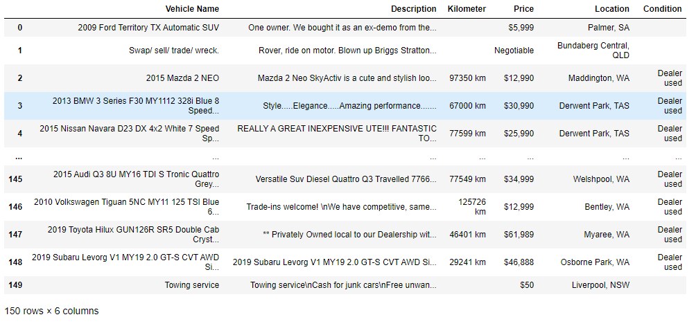

<h1 style="text-align: center;">Web Scraping Gumtree Car & Vehicle Listings</h1>

<h2>What is Gumtree?</h2>

We connect buyers and sellers in the local community, with more than 3 million listings across hundreds of categories you can buy, sell and find just about everything.

Gumtree is also the #1 in Australia for privately listed vehicles, so finding your dream ride is easy.

<h3>Project Overview</h3>

<ul>
    <li>
The purpose of this project is to scrape data from gumtree car & vehicle listings.
</li>
    <li>
This is done by cleaning and extracting the data using Python, BeautifulSoup and Pandas
</li>
    <li>
I then use the clean data and put it in a DataFrame using pandas and storing this into a .csv file
</li>
</ul>

Here's a representation of the data extracted from Gumtree Car & Vehicle Listings:

<h2>Requirements</h2>

<ul>
    <li>
Python 3 or latest version
</li>
    <li>
Jupyter Notebook
</li>
</ul>

<h2>Dependencies</h2>

<ul>
    <li>
pandas
</li>
    <li>
BeautifulSoup
</li>
    <li>
requests
</li>
    <li>
re
</li>
</ul>

